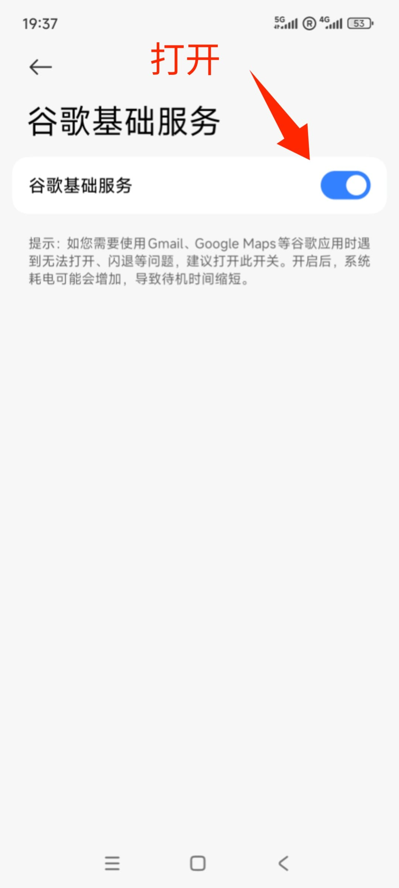
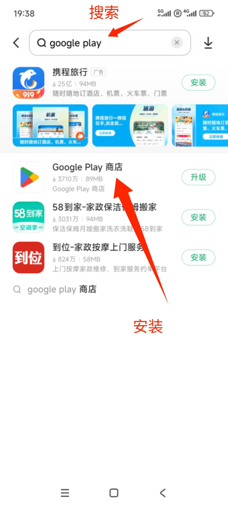

# 安卓系统安装谷歌三件套
- Google 服务框架
- Google play service
- Google play store

### 首先尝试直接使用谷歌安装器安装

-  [GO谷歌安装器](https://www.pgyer.com/pOEI)

-  [SU谷歌安装器](https://www.wandoujia.com/apps/7971105)

-  [HIGO谷歌安装器(支持部分华为)](https://www.wandoujia.com/apps/8124836)

-  [OurPlay(原谷歌空间)](https://www.wandoujia.com/apps/7661165)

-  [备用下载链接](https://github.com/sky22333/Google-Play-Store/releases)

### 小米手机自带谷歌套件，可直接启用

- 打开`设置`，搜索`谷歌`，启用`谷歌基础服务`

- 打开小米`应用商店`，搜索`google play`，安装`Google Play 商店`

---

> [!TIP]
> 下列方法需要科学上网的支持

## 1：安装Google服务框架

[Google服务框架下载地址](https://www.apkmirror.com/apk/google-inc/google-services-framework/)

### 🔔注意一定要选择你的安卓系统版本的服务框架，根据文件名字来找，下载apk版本。

---

## 2：安装Google play service

[Google play service下载地址](https://www.apkmirror.com/apk/google-inc/google-play-services/)

### 🔔注意一定要选择你的系统版本的下载，DPI也需要符合，点进去后下载最新版本，下载apk版本。

---

##  3：安装Google play store

[Google play store下载地址](https://www.apkmirror.com/apk/google-inc/google-play-store/)

### 🔔All Versions里面选择第一个最新版本就可以了，下载apk版本。

---

>  所有的方法都不行的话还可以尝试备用方案[GBox虚拟空间](https://gboxlab.com) 支持华为鸿蒙系统

#### 替代方案（可信的第三方APK商店）

- [APKMirror](https://www.apkmirror.com)

- [APKPure](https://apkpure.com/cn)
