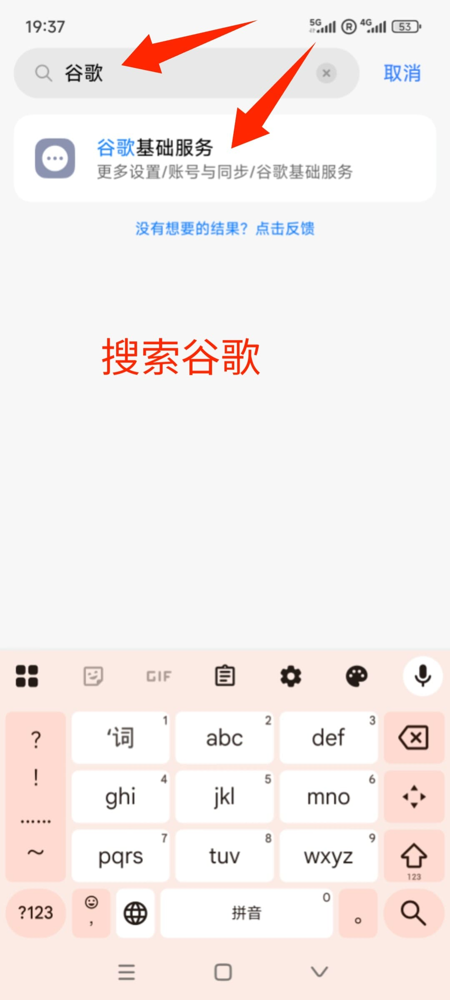
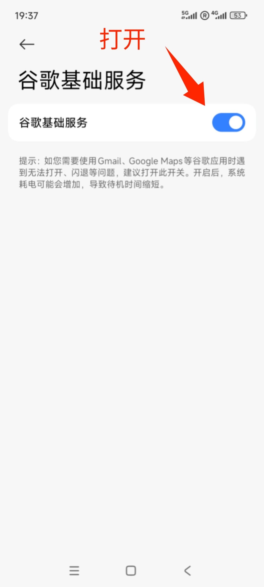
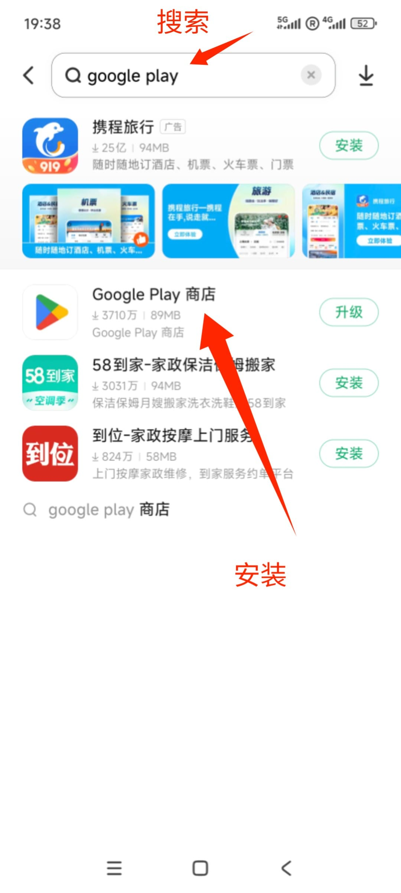

# 安卓系统安装谷歌三件套

**本文提供的所有软件地址均来自第三方，仅做指路作用，不做任何保证，请自行甄别风险**

安装内容：

* Google 服务框架（Google Services Framework）
* Google Play Services
* Google Play Store

相关包名：
```
com.google.android.gsf
com.google.android.gms
com.android.vending
com.google.android.gsf.login
```
---

# 优先尝试：谷歌安装器

优先尝试安装器方案，成功率较高，操作简单。

* [GO谷歌安装器](https://www.pgyer.com/pOEI)
* [SU谷歌安装器](https://www.wandoujia.com/apps/7971105)
* [G谷歌服务安装](https://www.wandoujia.com/apps/8436358)
* [HIGO谷歌安装器（部分旧版华为支持）](https://www.wandoujia.com/apps/8124836)
* [OurPlay（原谷歌空间）](https://www.wandoujia.com/apps/7661165)
* [备用下载链接](https://github.com/sky22333/Google-Play-Store/releases)

---

# 小米 / 红米 / 一加等机型

部分国产机已经内置谷歌基础组件，可直接启用。

参考：

[支持列表](https://storage.googleapis.com/play_public/supported_devices.html)

## 第一步：启用谷歌基础服务

步骤：

```text
设置 → 搜索「谷歌」→ 开启「谷歌基础服务」
```

<p align="center">


</p>


---

## 第二步：安装 Google Play 商店

步骤：

```text
应用商店 → 搜索 Google Play → 安装 Google Play 商店
```

<p align="center">

</p>

---

#### 注意：谷歌商店需要开启代理才能使用

---

> [!TIP]
>
> 以下通用方案通常需要科学上网环境。

# 通用安装方案

---

# 1. 安装 Google 服务框架

下载：

[Google 服务框架下载](https://www.apkmirror.com/apk/google-inc/google-services-framework/)

### 注意事项

* 必须选择匹配安卓版本
* 下载 APK 版本
* 根据文件名选择正确版本

<p align="center">

</p>

<p align="center">

</p>

<p align="center">

</p>

---

# 2. 安装 Google Play Services

下载：

[Google Play Services 下载](https://www.apkmirror.com/apk/google-inc/google-play-services/)

### 注意事项

* 安卓版本必须匹配
* DPI 必须匹配
* 下载 APK 版本
* 推荐最新版本

<p align="center">

</p>

<p align="center">

</p>

<p align="center">

</p>

---

# 3. 安装 Google Play Store

下载：

[Google Play Store 下载](https://www.apkmirror.com/apk/google-inc/google-play-store/)

### 注意事项

```text
All Versions → 选择第一个最新版本 → 下载 APK
```

<p align="center">

</p>

<p align="center">

</p>

---

# 4. 通用方案失效？

通过 ADB 安装为系统应用。

适用：

* 安卓模拟器
* Root 设备
* GMS 初始化失败
* 普通安装无效

原因：

```text
adb install → 用户应用 → GMS可能无法正常工作 → 需要系统特权应用
```

---

## 前提条件

* 已安装 ADB
* 已开启 USB 调试
* 已获得 Root
* /system 可写

ADB 下载：

[Android Platform Tools](https://developer.android.com/tools/releases/platform-tools)

---

## 第一步：确认连接

```powershell
adb devices
```

看到：

```text
设备序列号

或

127.0.0.1:端口
```

即成功。

---

## 第二步：确认版本和架构

```powershell
adb shell getprop ro.build.version.release
adb shell getprop ro.build.version.sdk
adb shell getprop ro.product.cpu.abi
```

选择规则：

* minAPI ≤ 当前 SDK
* ABI 必须匹配
* 或选择 nodpi 通用版

---

## 第三步：安装到系统分区

```powershell
adb root

adb shell mkdir -p /system/priv-app/GoogleServicesFramework
adb shell mkdir -p /system/priv-app/GooglePlayServices
adb shell mkdir -p /system/priv-app/Phonesky

adb push "路径/gsf.apk" /system/priv-app/GoogleServicesFramework/GoogleServicesFramework.apk

adb push "路径/gms.apk" /system/priv-app/GooglePlayServices/GooglePlayServices.apk

adb push "路径/vending.apk" /system/priv-app/Phonesky/Phonesky.apk

adb shell chmod 644 /system/priv-app/GoogleServicesFramework/GoogleServicesFramework.apk

adb shell chmod 644 /system/priv-app/GooglePlayServices/GooglePlayServices.apk

adb shell chmod 644 /system/priv-app/Phonesky/Phonesky.apk

adb reboot
```

---

## 第四步：验证安装

```powershell
adb shell pm list packages | grep google
```

---

# MuMu 模拟器 12

默认：

```text
设置 → 磁盘 → 系统盘可写 → 重启
```

验证：

```powershell
adb shell "mount | grep system"
```

确保：

```text
(rw,...)
```

---

> [!WARNING]
>
> MuMu 升级会覆盖 `/system`
>
> 建议备份实例

---

# 所有方法都失败？

备用方案：

[GBox 虚拟空间](https://gboxlab.com)

---

# 第三方 APK 商店

* [APKMirror](https://www.apkmirror.com)

* [APKPure](https://apkpure.com/cn)
